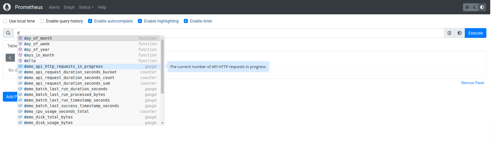

# Hexatek - Installation de Prometheus et Mimir


Dans ce tutoriel, nous allons installer:
- [Prometheus](https://prometheus.io/) pour la collecte des métriques (< 15 jours)
- [Grafana Mimir](https://grafana.com/oss/mimir/) pour la conservation des logs sur le long terme avec le stockage sur S3.

Pour le stockage S3 pour Mimir, nous allons utiliser [Minio](https://min.io/).


[Un service de simulation d'écriture de métriques](https://github.com/juliusv/prometheus_demo_service) est démarré parallèlement.


## Pré-requis

* Docker
* Docker Compose

## Comment démarrer le service de demo ?

1. Créer le fichier `.env.local`
2. Dans ce fichier, ajouter les variables d'environnement suivantes:
```
MINIO_ROOT_USER=<USERNAME>
MINIO_ROOT_PASSWORD=<MOT_DE_PASSE>
```
3. Exécuter la commande suivante:
```
# Démarre les containers en arrière tâche
$ docker compose up -d
```

Pour consulter les logs produits par un container, en cas d'échec de démarrage:

```
$ docker compose logs <CONTAINER>
```

## Consulter les métriques sur la web UI Prometheus

Les métriques collectées par Prometheus peuvent être consultées depuis la [WebUI](http://127.0.0.1:9090). Elle fonctionne sur le port **9090**.



