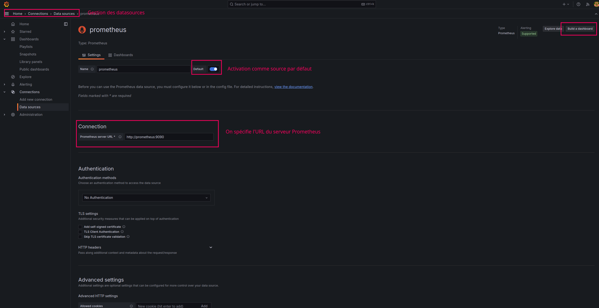
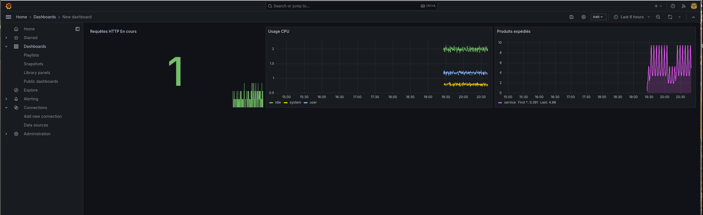

# Hexatek - Création d'un dashboard Grafana


Dans ce tutoriel, nous allons installer:
- [Grafana](https://grafana.com/) pour la création de dashboard.

## Pré-requis

* Docker
* Docker Compose

Vous devez avoir démarrer les containers [du précédent tutoriel](../02-prometheus-mimir/).

## Comment démarrer le service grafana ?

3. Exécuter la commande suivante:
```
# Démarre les containers en arrière tâche
$ docker compose up -d
```

Pour consulter les logs produits par un container, en cas d'échec de démarrage:

```
$ docker compose logs <CONTAINER>
```

Le login et mot de passe par défaut au démarrage est *admin*/*admin*.

## Création de la datasource Prometheus

Ajouter la datasource Prometheus dont l'URL est http://prometheus:9090.



## Création du dashboard

Créer un nouveau dashboard en ajoutant au minimum ces visualisations:



Aidez vous de la précédente activité PromQL pour ajouter d'autres visualisations.