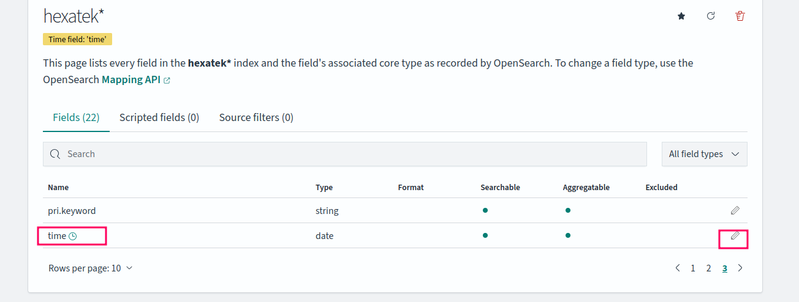

# Hexatek - Collecte et stockage des logs avec Fluentbit et OpenSearch

Dans ce tutoriel, nous allons installer:
- [Fluentbit](https://fluentbit.io) pour la collecte des logs.
- [OpenSearch](https://opensearch.org/) pour le stockage des logs.
- [OpenSearch Dashboard](https://opensearch.org/) pour la consultation.

## Pré-requis

* Docker
* Docker Compose
* nodejs
* npm

## Comment démarrer les services Fluentbit et OpenSearch ?

1. Ajouter le port forwarding sur le *port 5601* lors de l'ouverture de votre connexion SSH:

```
$ ssh -L 5601:0.0.0.0:5601 ....
```

2. Exécuter la commande suivante:
```
# Démarre les containers en arrière tâche
$ docker compose up -d
```

3. Ouvrez le [OpenSearch Dashboard](http://127.0.0.1:5601)

## Envoi de logs en SYSLOG avec logger

Depuis la console linux de votre VM, utiliser l'utilitaire `logger` pour envoyer un message au format SYSLOG:

```
# envoi en UDP sur le port 5140
$ logger --server localhost -P 5140 -d "ceci est un message d'information"
```

## Envoi de logs en OpenTelemetry avec le script Javascript:

Depuis la console linux de votre VM, démarrer l'envoi de logs en executant le script JavaScript:

```
$ cd hexatek/05-fluentbit-opensearch
$ npm run send-logs
```

Ce script utilise le SDK OpenTelemetry

## Consultation des logs depuis OpenSearch Dashboard:

### Création de l'index pattern:

- Allez dans la section [Dashboard Management](http://localhost:5601/app/management)

- Sélectionner `Index patterns`

- Créer un nouveau pattern en tapant `hexatek_index`. C'est le nom de l'index dans lequel sont écrits les logs.

- Sélectionner le champ `time` comme référence pour la date et l'heure:

- Editez le format du champ `time`:


## Consultation des logs:

- Ouvrir le dashboard de [OpenSearch](http://localhost:5601/)
- Sélectionner la section `Discover`

- Sélectionner votre index dans la section en haut à gauche:
