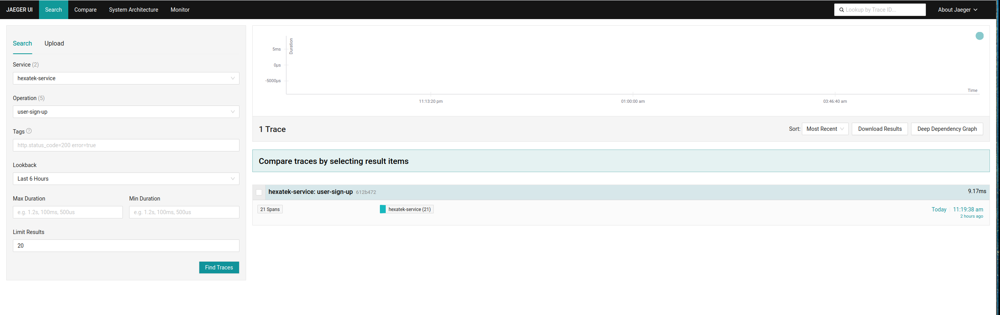
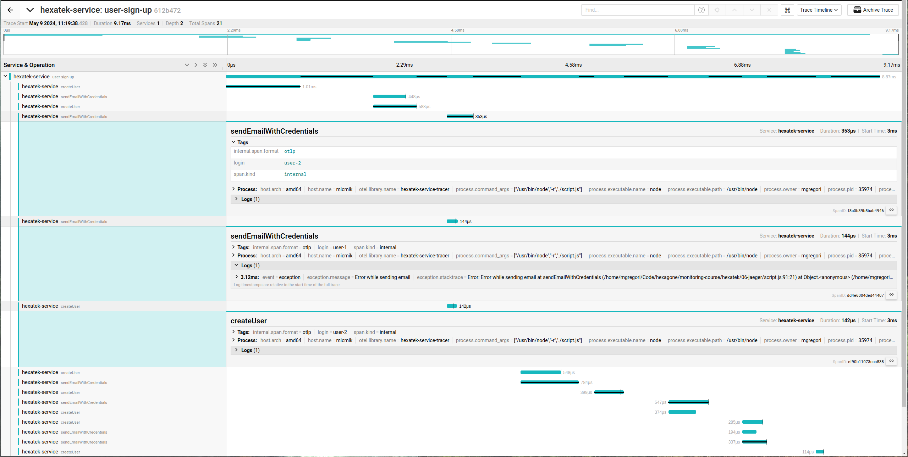
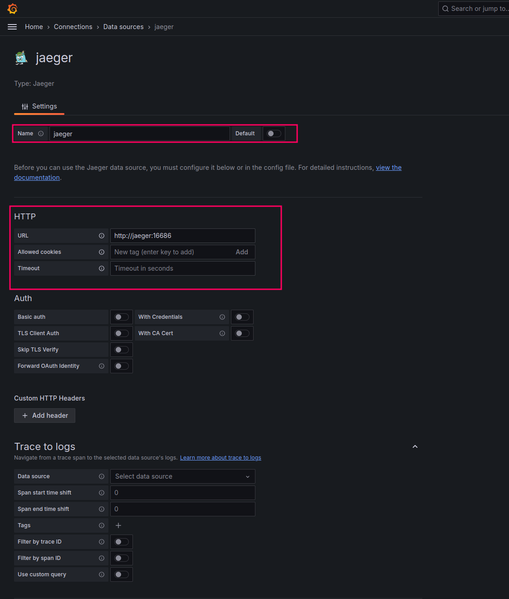
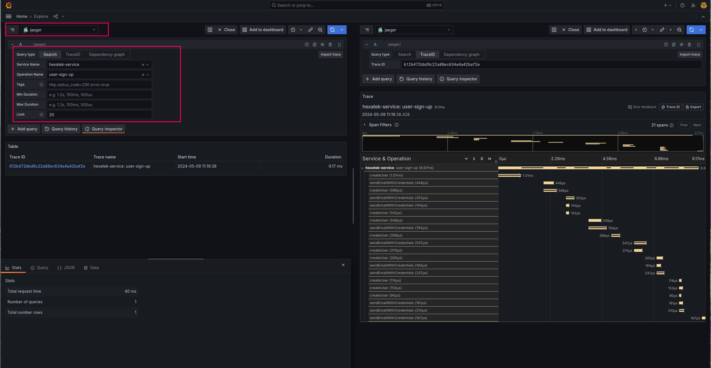

# Hexatek - Collecte des traces applicatives avec Jaeger et OpenTelemetry

Dans ce tutoriel, nous allons installer:
- [Jaeger](https://prometheus.io/docs/alerting/latest/alertmanager/) pour la collecte des traces applicatives.

## Pré-requis

* Docker
* Docker Compose
* nodejs
* npm

Vous devez avoir démarrer le container de Grafana [du précédent tutoriel](../03-grafana/).

## Comment démarrer le service Jaeger ?

1. Ajouter le port forwarding sur le *port 16686* lors de l'ouverture de votre connexion SSH:

```
$ ssh -L 16686:0.0.0.0:16686 ....
```

2. Exécuter la commande suivante:
```
# Démarre les containers en arrière tâche
$ docker compose up -d
```

3. Ouvrez la [WebUI](http://127.0.0.1:16686)

## Envoi de span avec le script Javascript:

Pour simuler l'envoi de traces applicatives, executer le script JavaScript ci-joint:

```
$ cd hexatek/06-jaeger
$ npm run send-samples
```

Tapez CTRL+C pour arreter l'execution du script

## Consultation des traces sur Jaeger:

- Ouvrir la [WebUI](http://127.0.0.1:16686)
- Rechercher les traces produites avec le scirpt JavaScript

- Consulter les spans en cliquant sur la derniere transaction:


## Consultation des traces depuis Grafana:

- Ouvrir la console de [Grafana](http://127.0.0.1:3000)
- Ajouter une nouvelle datasource de type Jaeger en spécifiant l'URL `http://jaeger:16686`:

- Explorer les données avec cette nouvelle datasource:
