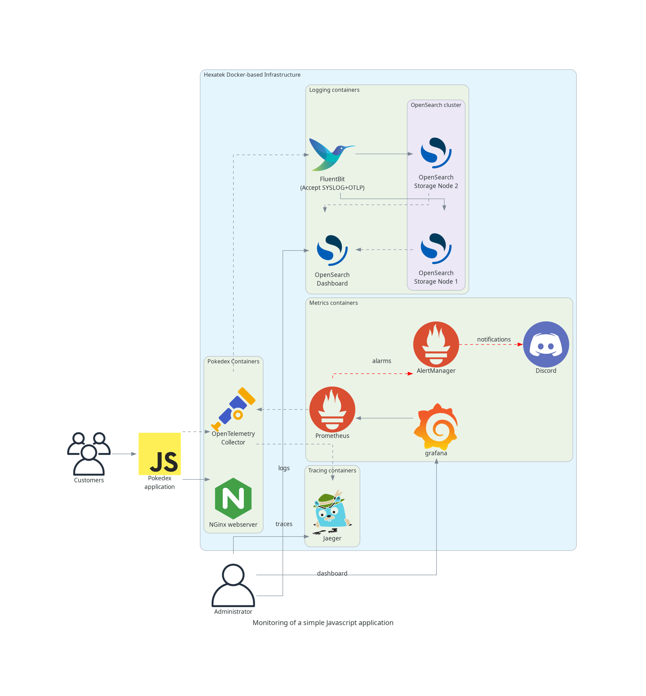
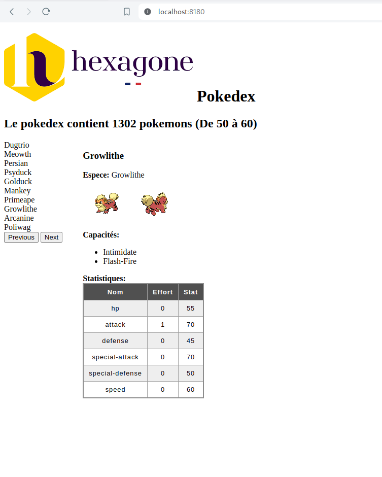
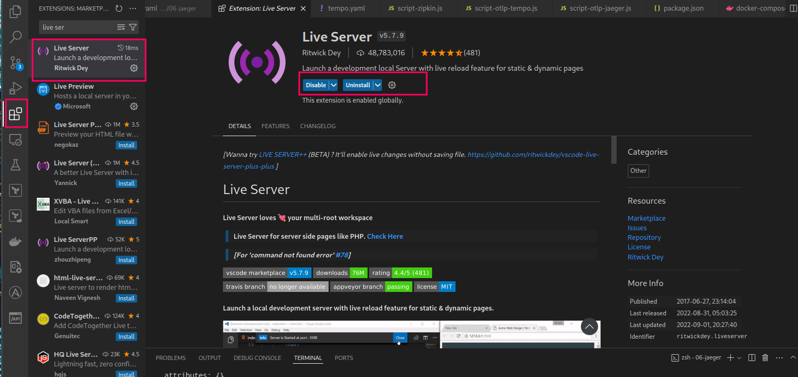
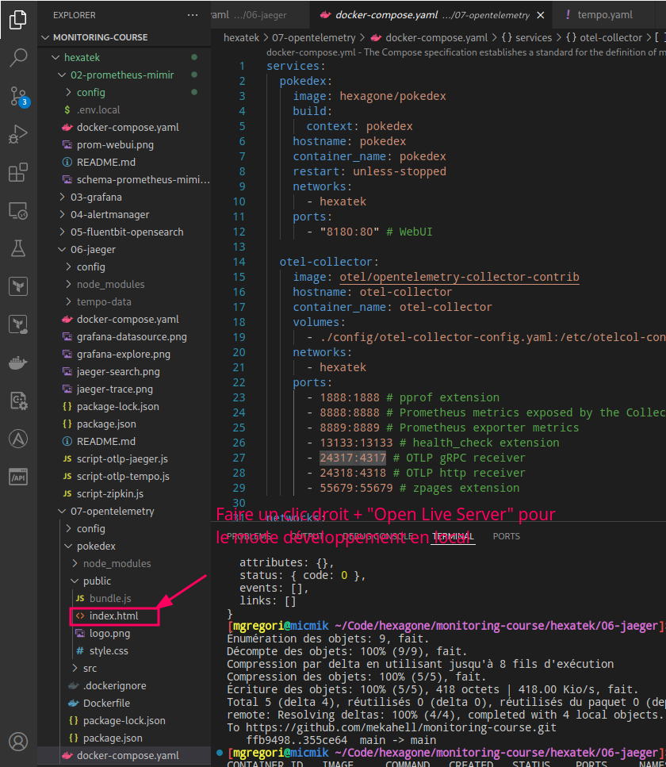

# Le Pokedex de Hexatek

Hexatek a implementé son propre Pokedex basé sur [l'API Pokemon](https://pokeapi.co/).

L'application Javascript utilise la librairie [pokeapi-js-wrapper](https://github.com/PokeAPI/pokeapi-js-wrapper) qui permet d'abstraire l'accès à l'API.

Le but de l'exercice ici est de:

1. Ajouter une instrumentation OpenTelemetry en utilisant le [SDK JS](https://opentelemetry.io/docs/languages/js/) pour collecter au minimum les **traces** et **métriques** de l'application. 
Ces informations seront envoyées vers OpenTelemetry Collector (cf. diagramme ci-dessous)

2. Après avoir collecter les métriques et traces, réaliser un nouveau dashboard dans [Grafana](http://localhost:3000) construit à partir de ces informations.



## Mise en route de l'application

Pour cette session, vous aurez besoin d’utiliser le port forwarding pour les ports suivants:
 - 4317 (OpenTelemetry)
 - 9090 (Prometheus)
 - 8180 (Application JS pokedex)
 - 3000 (Grafana).

Pour cela, ouvrez votre session avec la commande suivante:
```
# Remplacer <NUMERO_DE_PORT> par le port assigné à votre VM
# Remplacer <IP> par l’adresse IP du serveur
$ ssh -L 3000:0.0.0.0:3000 -L 4317:0.0.0.0:24317 -L 9090:0.0.0.0:9090 -L 8180:0.0.0.0:8180 -p <NUMERO_DE_PORT> hexadmin@<IP>
```

Sur votre VM, allez dans le répertoire ./hexatek/07-opentelemetry:

```
$ cd ./hexatek/07-opentelemetry
```

Pour vérifier que les containers du répertoire courant ne sont pas déjà démarrés, utilisez la commande suivante:

```
$ docker compose ps
```

Si le résultat de la commande est vide alors il faut passer à l’étape suivante.

La commande ci-dessous permet de démarrer les containers du répertoire courant en tâche de fond (option -d):

```
$ docker compose up -d
```

Vous pouvez maintenant ouvrir [l'application](http://127.0.0.1:8180) pour vérifier que tout fonctionne correctement



## Instrumentation de l'application JavaScript

Voici quelques informations et conseils pour faciliter vos développements sur l'application.

Pour vous aider consulter la documentation à ces adresses:
- Quick start pour [les applications frontend](https://opentelemetry.io/docs/languages/js/getting-started/browser/) 
- Des exemples sont disponibles [ici](https://github.com/open-telemetry/opentelemetry-js/tree/main/examples/opentelemetry-web)

La documentation des librairies Javascript est disponible [ici](https://open-telemetry.github.io/opentelemetry-js/)

Le fichier à modifier dans le projet est `./pokedex/src/app.js`

### Visual Studio Code

Je vous recommande d'utiliser l'application [Visual Studio Code](https://code.visualstudio.com/) pour réaliser vos développements. Aussi, ajouter l'extension live Server vous permettra de tester vos modifications à chaud.



Pour lancer *le live server*: 




### Rechargement et test de l'application depuis la VM

A chaque fois que vous modifiez le script **src/app.js**, il vous faut relancer un build de l’image docker pour tester vos résultats:

```
$ cd monitoring-course/hexatek/07-opentelemetry
$ docker compose down pokedex
$ docker compose up --build -d pokedex
```

### Rechargement et test de l'application depuis votre poste

Après modification du fichier `pokedex/src/app.js`, il faut rebuilder l’application en executant la commande suivante:

```
$ npm run build-js
```

Cette commande va reconstruire le fichier `pokedex/build/bundle.js` qui est le fichier chargé par votre navigateur.

